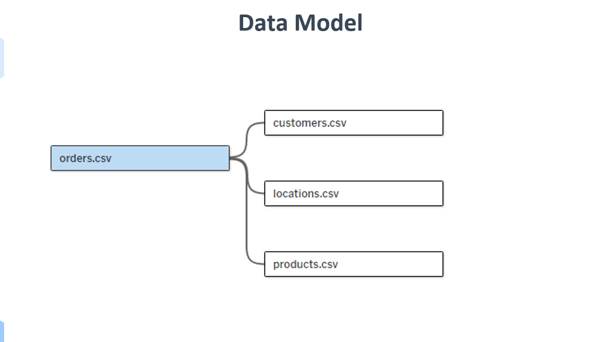
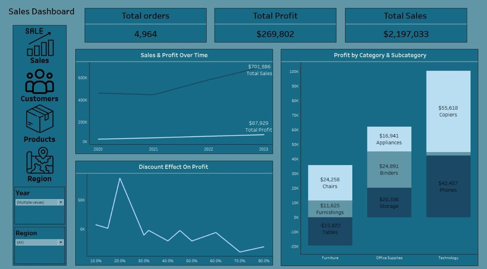
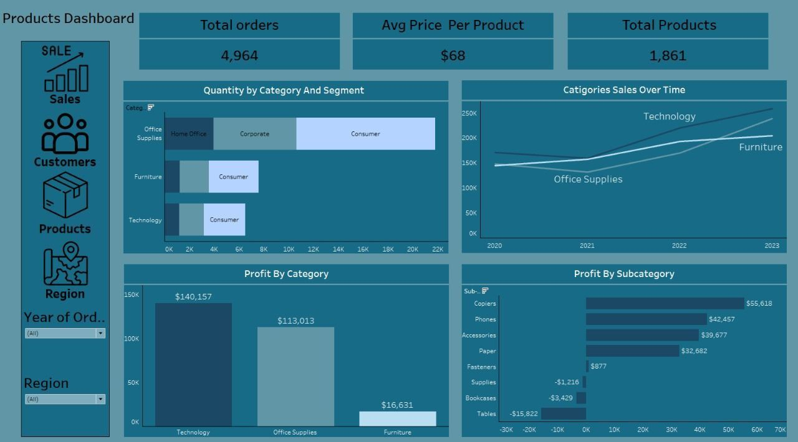
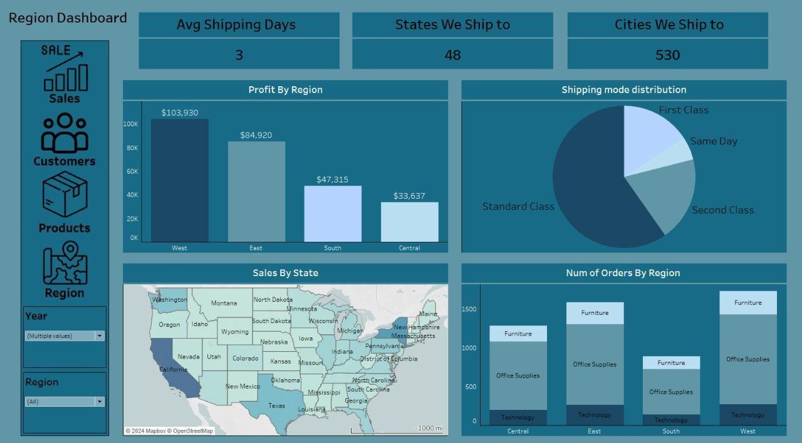

# Store Sales Analysis

## By: Abdelrhman Al-Sharkawi, Alaa Kotb, Ahmed Moheb, Moumen Amr  

## Project Overview  
This project analyzes the performance of an online store in the US over four years, examining sales, profit, customer trends, and other key insights to inform business strategies.

## 1. Data Overview  
- **Dataset**: [Sales Dataset](https://www.datawithbaraa.com/tableau/tableau-sales-project-thank-you/#google_vignette)  
- **Key Tables**:  
  - **Orders**: Row ID, Order ID, Order Date, Ship Date, Ship Mode, Customer ID, Segment, Postal Code, Product ID, Sales, Quantity, Discount, Profit  
  - **Products**: Product ID, Category, Sub-Category, Product Name  
  - **Customers**: Customer ID, Customer Name  
  - **Locations**: Postal Code, City, State, Region, CountryRegion  

## 2. Data Model  
- **Data Model Diagram**:   

## 3. Data Cleaning & Preparation  
- **Python Notebook**: [Data Cleaning Notebook]([DEPI FP(1).ipynb](http://localhost:8888/lab/tree/DEPI%20FP.ipynb))  
- **Tasks**: Missing data handling, data formatting, removing duplicates, and outlier detection.  

## 4. Exploratory Data Analysis (EDA)  
- **SQL Queries**: [SQL Queries](SQLQuery2[1].txt)  
- **Summarized Insights**:  
  1. **Location Analysis**: Analyzed total sales and profits by country, region, city, and state, identifying top-performing locations.  
  2. **Product Performance**: Explored sales and profit by product category and sub-category.  
  3. **Customer Segments**: Assessed sales, profit, and quantity sold by customer segment.  
  4. **Time Trends**: Tracked sales, profit, and quantity sold year-over-year, revealing growth patterns and demand trends.  
  5. **Shipping Insights**: Examined sales and profit by shipping modes and average shipping duration by region.  

## 5. Dashboard Visualizations  
We used Tableau to create our dashboards:  
- **Sales Dashboard**:   
- **Products Dashboard**:   
- **Customers Dashboard**:   
- **Region Dashboard**:   

## Key Insights and Recommendations  
### Sales and Profit Trends  
- **Sales and profit trends over the last few years**: Sales and profit steadily increased from 2020 to 2023, with a sharp sales growth in 2023 and profit increasing at a slower pace.  

- **Most profitable product categories/subcategories**: Technology leads in profit, especially Copiers and Phones. Tables in Furniture reported losses.  

- **Discount impact on profitability**: Profits peak with discounts between 15%-30%, but sharply decline with discounts over 30%.  

- **Top-performing regions and states**: The West region is the most profitable, with California, Texas, and New York leading in sales.  

- **Customer segment impact on sales and profit**: The Consumer segment generates the highest sales and profit, dominating overall revenue.  

- **Shipping methods and profit margins**: Standard Class is the most popular and profitable shipping method.  

- **Regional sales and product performance**: The West leads in both sales and profit, with Office Supplies dominating in all regions.  

- **Average sales and quantity per customer**: Average sales per customer are $2,771, with 7 items per customer. Office Supplies, especially Paper and Binders, are the most popular products.  

- **Shipping time and customer satisfaction**: Average shipping time is 3 days. Faster shipping options like Same Day are less common but effective in maintaining customer satisfaction.  

## Recommendations  
1. **Focus on Profitable Categories**:  
   - **Technology**: Enhance marketing for high-profit items like Copiers and Phones.  
   - **Office Supplies**: Maintain strong inventory for bestsellers like Paper and Binders.  

2. **Address Losses in Furniture**:  
   - Evaluate and adjust pricing or marketing for Tables; consider discontinuing low-demand products.  

3. **Optimize Discount Strategy**:  
   - Limit discounts beyond 30-40% to protect profit margins.  

4. **Leverage Regional Performance**:  
   - **West Region**: Expand product offerings and marketing.  
   - **South Region**: Increase brand presence and promotions to attract more customers.  

5. **Enhance Shipping Experience**:  
   - Improve delivery options for Second and First-Class shipping to boost customer satisfaction.  

6. **Capitalize on Consumer Segment**:  
   - Develop loyalty programs and personalized promotions to increase repeat purchases.  

7. **Boost Sales in Lower-Performing Categories**:  
   - Increase marketing efforts for Furniture and Office Supplies with bundled deals and discounts.  

8. **Refine Product Offerings by Segment**:  
   - Tailor recommendations and promotions based on the preferences of each customer segment.
  
## Conclusion
This Store Sales Analysis project provides valuable insights into the performance of an online store, highlighting key growth areas and opportunities for improvement. The findings can guide strategic decisions to enhance sales, profit, and customer satisfaction.

## Feedback and Contributions
We welcome any feedback or suggestions for improving this analysis. If you have any contributions or ideas, feel free to open an issue or submit a pull request.

## Contact Information
For any inquiries, please contact:
- **Abdelrhman Al-Sharkawi**: abdelrhmansharkawi@gmail.com

Connect with us on linkedin (linkedin.com/in/abdelrhmanwael)

## Acknowledgments
We would like to thank Eng. Aya Alghali for her guidance and support throughout this project.

  
